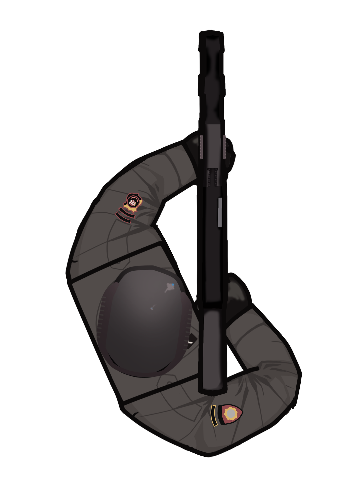

# Game Art Portofolio
- ### [Lihat galeri.](img/)
## Art di [CQB 2D](https://github.com/VozSoldat/CQB_2D_Game)

Di atas adalah karakter sprite dari polisi Indonesia dengan senjata AK-101. karakter polisi adalah salah satu karakter yang dapat dimainkan, di antaranya ada tentara, polisi, pasukan khusus TNI, dan polisi khusus.

Di atas adalah sprite dari pasukan Brimob Polri dengan senjata AKM. 

## Art di [Rest Area Business](https://burnedstar345.itch.io/rest-area-business-rupvy)

Gambar di atas adalah gambar rumah gadang untuk Rumah Makan Padang, salah satu jenis rumah makan yang dapat kita bangun dalam usaha *rest area* pemain. Ini adalah versi acuan yang kemudian di-*enhance* oleh artist lain dari tim saya.

## Art campur dan game yang tertunda.

Spritesheet karakter pixel untuk game RPG yang ditunda.

Uji coba skala karakter dengan bangunan.

Telur mata sapi.

Mencoba membuat patch velcro untuk baju/jaket.